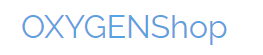

<!-- Improved compatibility of back to top link: See: https://github.com/othneildrew/Best-README-Template/pull/73 -->

<!--
*** Thanks for checking out the Best-README-Template. If you have a suggestion
*** that would make this better, please fork the repo and create a pull request
*** or simply open an issue with the tag "enhancement".
*** Don't forget to give the project a star!
*** Thanks again! Now go create something AMAZING! :D
-->

<!-- PROJECT SHIELDS -->
<!--
*** I'm using markdown "reference style" links for readability.
*** Reference links are enclosed in brackets [ ] instead of parentheses ( ).
*** See the bottom of this document for the declaration of the reference variables
*** for contributors-url, forks-url, etc. This is an optional, concise syntax you may use.
*** https://www.markdownguide.org/basic-syntax/#reference-style-links
-->
[![Contributors][contributors-shield]][contributors-url]
[![Forks][forks-shield]][forks-url]
[![Stargazers][stars-shield]][stars-url]
[![Issues][issues-shield]][issues-url]
[![MIT License][license-shield]][license-url]
[![LinkedIn][linkedin-shield]][linkedin-url]

<!-- TABLE OF CONTENTS -->

  
Table of Contents

  <ol>
    <li>
      <a href="#about-the-project">About The Project</a>
      <ul>
        <li><a href="#built-with">Built With</a></li>
      </ul>
    </li>
    <li><a href="#contributing">Contributing</a></li>
    <li><a href="#license">License</a></li>
    <li><a href="#contact">Contact</a></li>
    <li><a href="#acknowledgments">Acknowledgments</a></li>
  </ol>

<!-- ABOUT THE PROJECT -->
## About The Project

 

  

  <h3 align="center">OxygenShop</h3>

  

    An awesome platform to buy and sell oxygen-related products!
     
    <a href="https://github.com/S3rpa/OxygenShop"><strong>Explore the docs »</strong></a>
     
     
    <a href="https://s3rpa.github.io/OxygenShop/">View Demo</a>
    ·
    <a href="https://github.com/S3rpa/OxygenShop/issues/new?labels=bug&template=bug-report---.md">Report Bug</a>
    ·
    <a href="https://github.com/S3rpa/OxygenShop/issues/new?labels=enhancement&template=feature-request---.md">Request Feature</a>
  

### Built With

This section should list any major frameworks/libraries used to bootstrap your project. Leave any add-ons/plugins for the acknowledgements section. Here are a few examples.

* [![HTML][HTML]][HTML-url]
* [![CSS][CSS]][CSS-url]
* [![Sass][Sass]][Sass-url]
* [![JavaScript][JavaScript]][JavaScript-url]

(<a href="#readme-top">back to top</a>)

<!-- CONTRIBUTING -->
## Contributing

Contributions are what make the open source community such an amazing place to learn, inspire, and create. Any contributions you make are **greatly appreciated**.

If you have a suggestion that would make this better, please fork the repo and create a pull request. You can also simply open an issue with the tag "enhancement".
Don't forget to give the project a star! Thanks again!

1. Fork the Project
2. Create your Feature Branch (`git checkout -b feature/AmazingFeature`)
3. Commit your Changes (`git commit -m 'Add some AmazingFeature'`)
4. Push to the Branch (`git push origin feature/AmazingFeature`)
5. Open a Pull Request

(<a href="#readme-top">back to top</a>)

<!-- LICENSE -->
## License

Distributed under the MIT License. See `LICENSE.txt` for more information.

(<a href="#readme-top">back to top</a>)

<!-- CONTACT -->
## Contact

Sergio Barberá Solivella -  - sergiobarbera1@gmail.com

Project Link: [https://github.com/S3rpa/OxygenShop]([https://github.com/S3rpa/OxygenShop](https://github.com/S3rpa/OxygenShop))

(<a href="#readme-top">back to top</a>)

<!-- ACKNOWLEDGMENTS -->
## Acknowledgments

Use this space to list resources you find helpful and would like to give credit to. I've included a few of my favorites to kick things off!

* [Choose an Open Source License](https://choosealicense.com)
* [GitHub Emoji Cheat Sheet](https://www.webpagefx.com/tools/emoji-cheat-sheet)
* [Malven's Flexbox Cheatsheet](https://flexbox.malven.co/)
* [Malven's Grid Cheatsheet](https://grid.malven.co/)
* [Img Shields](https://shields.io)
* [GitHub Pages](https://pages.github.com)
* [Font Awesome](https://fontawesome.com)
* [React Icons](https://react-icons.github.io/react-icons/search)

(<a href="#readme-top">back to top</a>)

<!-- MARKDOWN LINKS & IMAGES -->
<!-- https://www.markdownguide.org/basic-syntax/#reference-style-links -->
[contributors-shield]: https://img.shields.io/github/contributors/othneildrew/Best-README-Template.svg?style=for-the-badge
[contributors-url]: https://github.com/S3rpa/OxygenShop/graphs/contributors
[forks-shield]: https://img.shields.io/github/forks/othneildrew/Best-README-Template.svg?style=for-the-badge
[forks-url]: https://github.com/S3rpa/OxygenShop/network/members
[stars-shield]: https://img.shields.io/github/stars/othneildrew/Best-README-Template.svg?style=for-the-badge
[stars-url]: https://github.com/S3rpa/OxygenShop/stargazers
[issues-shield]: https://img.shields.io/github/issues/othneildrew/Best-README-Template.svg?style=for-the-badge
[issues-url]: https://github.com/S3rpa/OxygenShop/issues
[license-shield]: https://img.shields.io/github/license/othneildrew/Best-README-Template.svg?style=for-the-badge
[license-url]: https://github.com/othneildrew/Best-README-Template/blob/master/LICENSE.txt
[linkedin-shield]: https://img.shields.io/badge/-LinkedIn-black.svg?style=for-the-badge&logo=linkedin&colorB=555
[linkedin-url]: www.linkedin.com/in/sergio-barbera-solivella
[product-screenshot]: https://gyazo.com/39e6ec9693764f87a76a30083c7d1445
[HTML]: https://img.shields.io/badge/HTML5-E34F26?style=for-the-badge&logo=html5&logoColor=white
[HTML-url]: 	http://www.w3.org/TR/html5/
[CSS]: 	https://img.shields.io/badge/CSS3-1572B6?style=for-the-badge&logo=css3&logoColor=white
[CSS-url]: https://www.w3.org/Style/CSS/
[Sass]: https://img.shields.io/badge/Sass-CC6699?style=for-the-badge&logo=sass&logoColor=white
[Sass-url]: https://vuejs.org/
[JavaScript]: https://img.shields.io/badge/JavaScript-323330?style=for-the-badge&logo=javascript&logoColor=F7DF1E
[JavaScript-url]: https://developer.mozilla.org/es/docs/Web/JavaScript
